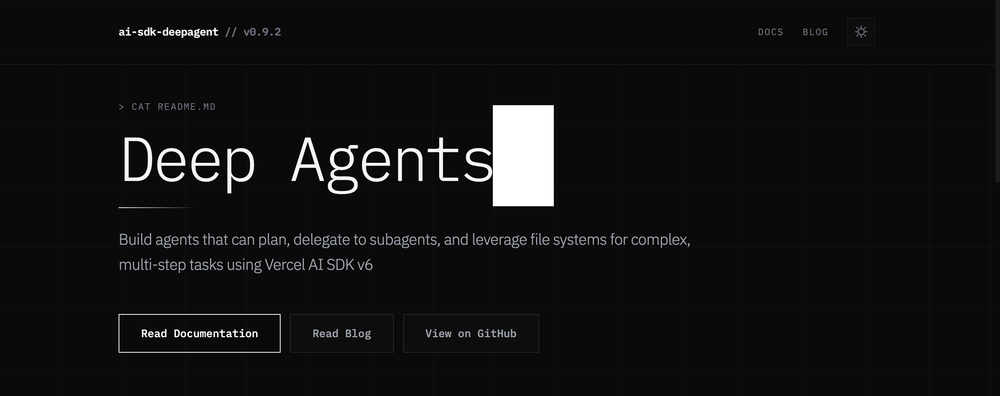

# AI SDK Deep Agent

<p align="center">
  
</p>

[](https://www.npmjs.com/package/ai-sdk-deep-agent)
[](https://opensource.org/licenses/MIT)
[](https://deepwiki.com/chrispangg/ai-sdk-deepagent)
[](https://ai-sdk-deepagent.vercel.app/docs)

> **Note:** This package requires [Bun](https://bun.sh) runtime. It uses Bun-specific features and TypeScript imports.

A TypeScript library for building controllable AI agents using [Vercel AI SDK](https://ai-sdk.dev/). This is a reimplementation of [deepagentsjs](https://github.com/langchain-ai/deepagentsjs) without any LangChain/LangGraph dependencies.

## What is Deep Agent?

Using an LLM to call tools in a loop is the simplest form of an agent. This architecture, however, can yield agents that are "shallow" and fail to plan and act over longer, more complex tasks.

Deep Agent addresses these limitations through four core architectural components:

| Component | Purpose | Implementation |
|-----------|---------|----------------|
| **Planning Tool** | Long-term task breakdown and tracking | `write_todos` for maintaining task lists |
| **Sub Agents** | Task delegation and specialization | `task` tool for spawning specialized agents |
| **File System Access** | Persistent state and information storage | Virtual filesystem with `read_file`, `write_file`, `edit_file` |
| **Detailed Prompts** | Context-aware instructions | Sophisticated prompting strategies |

## Installation

This package requires Bun runtime:

```bash
# Install Bun if you haven't already
curl -fsSL https://bun.sh/install | bash

# Install the package
bun add ai-sdk-deep-agent

# Or install globally for CLI usage
bun add -g ai-sdk-deep-agent
```

**Why Bun?** This package publishes TypeScript source directly and uses Bun-specific optimizations for better performance.

## Quick Start

```typescript
import { createDeepAgent } from 'ai-sdk-deep-agent';
import { anthropic } from '@ai-sdk/anthropic';

const agent = createDeepAgent({
  model: anthropic('claude-sonnet-4-5-20250929'),
  systemPrompt: 'You are an expert researcher.',
});

const result = await agent.generate({
  prompt: 'Research the topic of quantum computing and write a report',
});

console.log(result.text);
console.log('Todos:', result.state.todos);
console.log('Files:', Object.keys(result.state.files));
```

## Features

### Structured Output

Deep agents can return typed, validated objects using Zod schemas alongside text responses:

```typescript
import { z } from 'zod';

const agent = createDeepAgent({
  model: anthropic('claude-sonnet-4-5-20250929'),
  output: {
    schema: z.object({
      summary: z.string(),
      keyPoints: z.array(z.string()),
    }),
    description: 'Research findings',
  },
});

const result = await agent.generate({
  prompt: "Research latest AI developments",
});

console.log(result.output?.summary);      // string
console.log(result.output?.keyPoints);    // string[]
```

### Streaming with Events

Stream responses with real-time events for tool calls, file operations, and more:

```typescript
for await (const event of agent.streamWithEvents({
  prompt: 'Build a todo app',
})) {
  switch (event.type) {
    case 'text':
      process.stdout.write(event.text);
      break;
    case 'tool-call':
      console.log(`Calling: ${event.toolName}`);
      break;
    case 'file-written':
      console.log(`Written: ${event.path}`);
      break;
  }
}
```

### Built-in Tools

- **Planning**: `write_todos` for task management
- **Filesystem**: `read_file`, `write_file`, `edit_file`, `ls`, `glob`, `grep`
- **Web**: `web_search`, `http_request`, `fetch_url` (requires Tavily API key)
- **Execute**: Shell command execution with `LocalSandbox` backend
- **Subagents**: Spawn specialized agents for complex subtasks

## Documentation

For comprehensive guides, API reference, and examples, visit **[ai-sdk-deepagent.vercel.app/docs](https://ai-sdk-deepagent.vercel.app/docs)**

### Key Documentation Sections

- **[Get Started](https://ai-sdk-deepagent.vercel.app/docs/get-started)** - Installation and basic setup
- **[Guides](https://ai-sdk-deepagent.vercel.app/docs/guides)** - In-depth tutorials on:
  - Configuration options (models, backends, middleware)
  - Custom tools and subagents
  - Agent memory and persistence
  - Prompt caching and conversation summarization
  - Web tools and API integration
- **[Reference](https://ai-sdk-deepagent.vercel.app/docs/reference)** - Complete API documentation

## CLI

The interactive CLI is built with [Ink](https://github.com/vadimdemedes/ink):

```bash
# Run without installing (recommended)
bunx ai-sdk-deep-agent

# Or install globally
bun add -g ai-sdk-deep-agent
deep-agent

# With options
bunx ai-sdk-deep-agent --model anthropic/claude-haiku-4-5-20251001
```

**API Keys**: Load from environment variables (`ANTHROPIC_API_KEY`, `OPENAI_API_KEY`, `TAVILY_API_KEY`) or `.env` file.

## License

MIT
