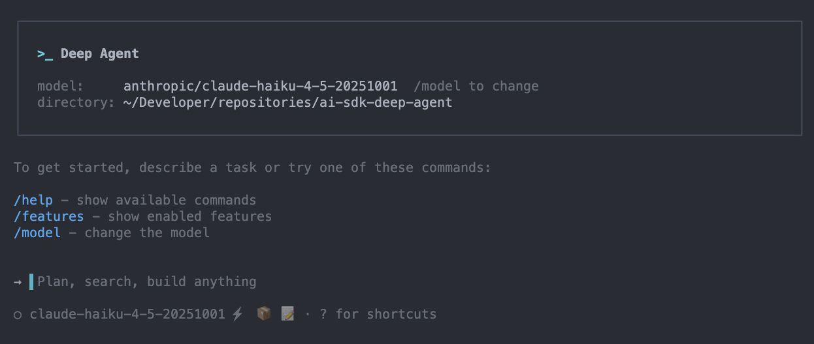

# AI SDK Deep Agent

<p align="center">
  
</p>

[](https://www.npmjs.com/package/ai-sdk-deep-agent)
[](https://opensource.org/licenses/MIT)
[](https://deepwiki.com/chrispangg/ai-sdk-deepagent)

> **Note:** This package requires [Bun](https://bun.sh) runtime. It uses Bun-specific features and TypeScript imports.

A TypeScript library for building controllable AI agents using [Vercel AI SDK](https://ai-sdk.dev/). This is a reimplementation of [deepagentsjs](https://github.com/langchain-ai/deepagentsjs) without any LangChain/LangGraph dependencies.

## What are Deep Agents?

Using an LLM to call tools in a loop is the simplest form of an agent. This architecture, however, can yield agents that are "shallow" and fail to plan and act over longer, more complex tasks.

Deep Agents address these limitations through four core architectural components:

| Component | Purpose | Implementation |
|-----------|---------|----------------|
| **Planning Tool** | Long-term task breakdown and tracking | `write_todos` for maintaining task lists |
| **Sub Agents** | Task delegation and specialization | `task` tool for spawning specialized agents |
| **File System Access** | Persistent state and information storage | Virtual filesystem with `read_file`, `write_file`, `edit_file` |
| **Detailed Prompts** | Context-aware instructions | Sophisticated prompting strategies |

## Installation

This package requires Bun runtime:

```bash
# Install Bun if you haven't already
curl -fsSL https://bun.sh/install | bash

# Install the package
bun add ai-sdk-deep-agent

# Or install globally for CLI usage
bun add -g ai-sdk-deep-agent
```

**Why Bun?** This package publishes TypeScript source directly and uses Bun-specific optimizations for better performance.

## Quick Start

```typescript
import { createDeepAgent } from 'ai-sdk-deep-agent';
import { anthropic } from '@ai-sdk/anthropic';

const agent = createDeepAgent({
  model: anthropic('claude-sonnet-4-5-20250929'),
  systemPrompt: 'You are an expert researcher.',
});

const result = await agent.generate({
  prompt: 'Research the topic of quantum computing and write a report',
});

console.log(result.text);
console.log('Todos:', result.state.todos);
console.log('Files:', Object.keys(result.state.files));
```

## Structured Output

Deep agents can return typed, validated objects using Zod schemas alongside text responses:

```typescript
import { createDeepAgent } from 'ai-sdk-deep-agent';
import { anthropic } from '@ai-sdk/anthropic';
import { z } from 'zod';

const agent = createDeepAgent({
  model: anthropic('claude-sonnet-4-20250514'),
  output: {
    schema: z.object({
      summary: z.string(),
      keyPoints: z.array(z.string()),
      confidence: z.number().min(0).max(1),
    }),
    description: 'Research findings with confidence score',
  },
});

const result = await agent.generate({
  prompt: "Research latest AI developments",
});

// Fully typed output
console.log(result.output?.summary);      // string
console.log(result.output?.keyPoints);    // string[]
console.log(result.output?.confidence);   // number
```

**Key Features:**
- **Type Safety**: `result.output` is fully typed based on your Zod schema
- **Validation**: Automatic runtime validation against the schema
- **Works with Tools**: Can be combined with tools for complex workflows
- **Optional**: Completely backwards compatible - existing code works unchanged

### Subagent Structured Output

Subagents can also have their own structured output schemas:

```typescript
const agent = createDeepAgent({
  model: anthropic('claude-sonnet-4-20250514'),
  subagents: [
    {
      name: 'researcher',
      description: 'Conducts research',
      systemPrompt: 'You are a research specialist...',
      output: {
        schema: z.object({
          findings: z.array(z.string()),
          sources: z.array(z.string()),
        }),
      },
    },
  ],
});
```

See [`examples/with-structured-output.ts`](./examples/with-structured-output.ts) for more examples.

## Configuration

### Model

Specify the model using AI SDK provider instances (supports any provider from the Vercel AI SDK ecosystem):

```typescript
import { anthropic } from '@ai-sdk/anthropic';
import { openai } from '@ai-sdk/openai';
import { azure } from '@ai-sdk/azure';

// Anthropic
const agent1 = createDeepAgent({
  model: anthropic('claude-sonnet-4-5-20250929'),
});

// OpenAI
const agent2 = createDeepAgent({
  model: openai('gpt-5'),
});

// Azure OpenAI
const agent3 = createDeepAgent({
  model: azure('gpt-5-mini', {
    apiKey: process.env.AZURE_OPENAI_API_KEY,
    resourceName: 'my-resource',
  }),
});

// With custom configuration
const agent4 = createDeepAgent({
  model: anthropic('claude-sonnet-4-5-20250929', {
    apiKey: process.env.CUSTOM_API_KEY,
    baseURL: 'https://custom-endpoint.com',
  }),
});
```

This approach allows you to:

- Configure API keys, base URLs, and timeouts per provider
- Use any AI SDK-compatible provider (Anthropic, OpenAI, Azure, Bedrock, Groq, etc.)
- Mix and match models for main agent vs. subagents

### Custom Tools

Add your own tools alongside the built-in ones:

```typescript
import { tool } from 'ai';
import { z } from 'zod';

const weatherTool = tool({
  description: 'Get the weather in a location',
  parameters: z.object({
    city: z.string(),
  }),
  execute: async ({ city }) => {
    return `The weather in ${city} is sunny.`;
  },
});

const agent = createDeepAgent({
  tools: { weather: weatherTool },
});
```

### Subagents

Define specialized subagents for task delegation:

```typescript
import { createDeepAgent, type SubAgent } from 'ai-sdk-deep-agent';
import { anthropic } from '@ai-sdk/anthropic';

const researchSubagent: SubAgent = {
  name: 'research-agent',
  description: 'Used for in-depth research on specific topics',
  systemPrompt: 'You are a dedicated researcher...',
  // Optional: use a different model for this subagent
  model: anthropic('claude-haiku-4-5-20251001'),
};

const agent = createDeepAgent({
  model: anthropic('claude-sonnet-4-20250514'),
  subagents: [researchSubagent],
});
```

### Backends

Choose how files are stored:

```typescript
import { createDeepAgent, StateBackend, FilesystemBackend, PersistentBackend, InMemoryStore, LocalSandbox } from 'ai-sdk-deep-agent';
import { anthropic } from '@ai-sdk/anthropic';

// Default: In-memory (ephemeral)
const agent1 = createDeepAgent({
  model: anthropic('claude-sonnet-4-5-20250929'),
});

// Filesystem: Persist to disk
const agent2 = createDeepAgent({
  model: anthropic('claude-sonnet-4-5-20250929'),
  backend: new FilesystemBackend({ rootDir: './agent-workspace' }),
});

// Persistent: Cross-conversation memory with custom store
const store = new InMemoryStore(); // Or implement KeyValueStore for Redis, SQLite, etc.
const agent3 = createDeepAgent({
  model: anthropic('claude-sonnet-4-5-20250929'),
  backend: new PersistentBackend({ store, namespace: 'my-project' }),
});

// LocalSandbox: Execute shell commands + filesystem access
// The 'execute' tool is automatically added when using LocalSandbox!
const agent4 = createDeepAgent({
  model: anthropic('claude-sonnet-4-5-20250929'),
  backend: new LocalSandbox({
    cwd: './workspace',
    timeout: 60000, // 60 second timeout for commands
    env: { NODE_ENV: 'development' },
  }),
});

// Manually add execute tool with FilesystemBackend
// Use FilesystemBackend for file operations + LocalSandbox just for command execution
import { createExecuteTool } from 'ai-sdk-deep-agent';

const filesystemBackend = new FilesystemBackend({ rootDir: './agent-workspace' });
const sandbox = new LocalSandbox({ cwd: './workspace' });

const agent5 = createDeepAgent({
  model: anthropic('claude-sonnet-4-5-20250929'),
  backend: filesystemBackend, // Files stored on disk
  tools: {
    execute: createExecuteTool({ backend: sandbox }), // Manual execute tool
  },
});

// CompositeBackend: Combine FilesystemBackend + LocalSandbox
// Route files to filesystem, but use sandbox for command execution
import { CompositeBackend } from 'ai-sdk-deep-agent';

const compositeBackend = new CompositeBackend(
  new FilesystemBackend({ rootDir: './default' }),
  {
    '/workspace/': new LocalSandbox({ cwd: './workspace' }),
  }
);

const sandboxForCommands = new LocalSandbox({ cwd: './workspace' });

const agent6 = createDeepAgent({
  model: anthropic('claude-sonnet-4-5-20250929'),
  backend: compositeBackend, // Files in /workspace/ use LocalSandbox, others use FilesystemBackend
  tools: {
    execute: createExecuteTool({ backend: sandboxForCommands }), // Manual execute tool
  },
});
```

### Middleware

Deep Agents support AI SDK middleware for intercepting and modifying model behavior. Middleware allows you to add cross-cutting concerns like logging, caching, telemetry, and custom memory systems without modifying agent logic.

#### How Middleware Works

Middleware wraps the model's `generate` function to intercept calls and responses:

```typescript
import type { LanguageModelMiddleware } from 'ai';

const myMiddleware: LanguageModelMiddleware = {
  specificationVersion: 'v3',
  wrapGenerate: async ({ doGenerate, params }) => {
    // Before: inspect/modify params
    console.log('Model called with prompt:', params.prompt?.[0]?.content);

    // Call the model
    const result = await doGenerate();

    // After: inspect/modify result
    console.log('Model responded with:', result.content);

    return result;
  },
};

const agent = createDeepAgent({
  model: anthropic('claude-sonnet-4-5-20250929'),
  middleware: myMiddleware,
});
```

#### Multiple Middleware

Chain multiple middleware in order:

```typescript
const agent = createDeepAgent({
  model: anthropic('claude-sonnet-4-5-20250929'),
  middleware: [
    loggingMiddleware,
    cachingMiddleware,
    telemetryMiddleware,
  ],
});
```

#### Common Middleware Patterns

**Logging Middleware:**

```typescript
const loggingMiddleware: LanguageModelMiddleware = {
  specificationVersion: 'v3',
  wrapGenerate: async ({ doGenerate, params }) => {
    const startTime = Date.now();
    console.log('📝 Calling model...');

    try {
      const result = await doGenerate();
      const duration = Date.now() - startTime;
      console.log(`✅ Model responded in ${duration}ms`);
      return result;
    } catch (error) {
      console.error('❌ Model call failed:', error);
      throw error;
    }
  },
};
```

**Caching Middleware:**

```typescript
const cache = new Map<string, any>();

const cachingMiddleware: LanguageModelMiddleware = {
  specificationVersion: 'v3',
  wrapGenerate: async ({ doGenerate, params }) => {
    const cacheKey = JSON.stringify(params.prompt);

    if (cache.has(cacheKey)) {
      console.log('💾 Cache hit!');
      return cache.get(cacheKey);
    }

    console.log('📥 Cache miss, calling model...');
    const result = await doGenerate();
    cache.set(cacheKey, result);
    return result;
  },
};
```

**Request/Response Transformation:**

```typescript
const transformationMiddleware: LanguageModelMiddleware = {
  specificationVersion: 'v3',
  wrapGenerate: async ({ doGenerate, params }) => {
    // Modify request
    const modifiedParams = {
      ...params,
      system: (params.system || []).map(msg => ({
        ...msg,
        content: msg.content + '\n\n[Added by middleware]',
      })),
    };

    // Call model with modified params
    const result = await doGenerate();

    // Modify response
    return {
      ...result,
      content: result.content.map(block => ({
        ...block,
        text: block.type === 'text'
          ? block.text + '\n[Processed by middleware]'
          : block.text,
      })),
    };
  },
};
```

#### Prebuilt: Agent Memory Middleware

The library includes a prebuilt middleware for managing user-level agent memory. It automatically loads memory files before each generation and makes them available to the agent:

```typescript
import { createDeepAgent, createAgentMemoryMiddleware } from 'ai-sdk-deep-agent';

const memoryMiddleware = createAgentMemoryMiddleware({
  agentId: 'my-agent',
  // Optional: custom directory for memory files
  userDeepagentsDir: '~/.deepagents',
  // Optional: request approval before creating directories
  requestProjectApproval: async (projectPath) => {
    console.log(`Create memory directory in ${projectPath}?`);
    return true;
  },
});

const agent = createDeepAgent({
  model: anthropic('claude-sonnet-4-5-20250929'),
  middleware: memoryMiddleware,
});
```

See the [Agent Memory](#agent-memory) section below for more details on using memory files.

### Agent Memory

Give your agent persistent memory across conversations using the agent memory middleware:

```typescript
import { createDeepAgent, createAgentMemoryMiddleware } from 'ai-sdk-deep-agent';

// Option 1: Using agentId (recommended - enables both memory and skills)
const agent = createDeepAgent({
  model: anthropic('claude-sonnet-4-5-20250929'),
  agentId: 'my-coding-assistant',
  // Memory auto-loaded from:
  // - ~/.deepagents/my-coding-assistant/agent.md (user-level)
  // - .deepagents/agent.md (project-level, if in git repo)
});

// Option 2: Using middleware directly (for advanced control)
const memoryMiddleware = createAgentMemoryMiddleware({
  agentId: 'my-agent',
  requestProjectApproval: async (projectPath) => {
    // Optionally request user approval before creating .deepagents/ directory
    console.log(`Create memory directory in ${projectPath}?`);
    return true;
  },
});

const agent = createDeepAgent({
  model: anthropic('claude-sonnet-4-5-20250929'),
  middleware: memoryMiddleware,
});
```

**Memory files are plain markdown**:

```markdown
# My Coding Assistant

## User Preferences
- Prefers 2-space indentation
- Likes comprehensive JSDoc comments

## Working Style
- Ask clarifying questions before implementing
- Consider edge cases and error handling
```

The agent can read and update its own memory using filesystem tools. See [Agent Memory Documentation](./docs/agent-memory.md) for details.

### Prompt Caching (Anthropic)

Enable prompt caching for improved performance with Anthropic models:

```typescript
import { anthropic } from '@ai-sdk/anthropic';

const agent = createDeepAgent({
  model: anthropic('claude-sonnet-4-5-20250929'),
  enablePromptCaching: true, // Caches system prompt for faster subsequent calls
});
```

### Tool Result Eviction

Automatically evict large tool results to prevent context overflow:

```typescript
const agent = createDeepAgent({
  toolResultEvictionLimit: 20000, // Evict results > 20k tokens to filesystem
});
```

### Conversation Summarization

Automatically summarize older messages when approaching token limits:

```typescript
import { anthropic } from '@ai-sdk/anthropic';

const agent = createDeepAgent({
  model: anthropic('claude-sonnet-4-5-20250929'),
  summarization: {
    enabled: true,
    tokenThreshold: 170000, // Trigger summarization at 170k tokens
    keepMessages: 6, // Keep last 6 messages intact
    model: anthropic('claude-haiku-4-5-20251001'), // Use fast model for summarization
  },
});
```

## Built-in Tools

### Planning: `write_todos`

Manages a task list for complex multi-step operations:

```
- Track tasks with statuses: pending, in_progress, completed, cancelled
- Merge or replace existing todos
- Only one task should be in_progress at a time
```

### Filesystem Tools

| Tool | Description |
|------|-------------|
| `ls` | List files in a directory |
| `read_file` | Read file contents with line numbers |
| `write_file` | Create a new file |
| `edit_file` | Replace text in an existing file |
| `glob` | Find files matching a pattern |
| `grep` | Search for text within files |

### Web Tools

Enable web interaction capabilities for research, API calls, and content fetching:

| Tool | Description |
|------|-------------|
| `web_search` | Search the web using Tavily API (requires `TAVILY_API_KEY`) |
| `http_request` | Make HTTP requests (GET, POST, PUT, DELETE, PATCH) to APIs |
| `fetch_url` | Fetch web page content and convert HTML to clean Markdown |

**Requirements:**

- Set `TAVILY_API_KEY` environment variable for `web_search` tool
- Without API key, web tools are gracefully disabled

**Example:**

```typescript
import { createDeepAgent } from 'ai-sdk-deep-agent';
import { anthropic } from '@ai-sdk/anthropic';

// Set API key (or use .env file)
process.env.TAVILY_API_KEY = 'tvly-your-key';

const agent = createDeepAgent({
  model: anthropic('claude-sonnet-4-5-20250929'),
});

// Agent can now use web tools
for await (const event of agent.streamWithEvents({
  prompt: 'Research the latest React 19 features and summarize them',
})) {
  switch (event.type) {
    case 'web-search-start':
      console.log(`🔍 Searching: ${event.query}`);
      break;
    case 'web-search-finish':
      console.log(`✓ Found ${event.resultCount} results`);
      break;
    case 'fetch-url-start':
      console.log(`📄 Fetching: ${event.url}`);
      break;
    case 'fetch-url-finish':
      console.log(event.success ? '✓ Content fetched' : '✗ Failed');
      break;
    case 'http-request-start':
      console.log(`🌐 ${event.method} ${event.url}`);
      break;
    case 'http-request-finish':
      console.log(`✓ Status: ${event.statusCode}`);
      break;
    case 'text':
      process.stdout.write(event.text);
      break;
  }
}
```

**Features:**

- ✅ `web_search`: Powered by Tavily API (93.3% accuracy on SimpleQA benchmark)
- ✅ `http_request`: Full HTTP client with headers, query params, JSON/text parsing
- ✅ `fetch_url`: HTML → Markdown conversion with Mozilla Readability
- ✅ Article extraction: Removes navigation, ads, and extracts main content
- ✅ Result eviction: Large responses automatically saved to filesystem
- ✅ CLI approval: `web_search` and `fetch_url` require user approval in Safe Mode

### Execute Tool (Sandbox Backends)

When using a `LocalSandbox` backend (or any `SandboxBackendProtocol`), the `execute` tool is **automatically added**:

| Tool | Description |
|------|-------------|
| `execute` | Execute shell commands in the sandbox environment |

**Features:**

- Runs commands in the sandbox's working directory
- Returns command output, exit code, and truncation status
- Supports timeout limits
- Automatically available - no manual setup required!

**Example:**

```typescript
import { createDeepAgent, LocalSandbox } from 'ai-sdk-deep-agent';
import { anthropic } from '@ai-sdk/anthropic';

const sandbox = new LocalSandbox({
  cwd: './workspace',
  timeout: 60000,
});

const agent = createDeepAgent({
  model: anthropic('claude-sonnet-4-5-20250929'),
  backend: sandbox, // execute tool is automatically added!
});

// Agent can now use execute tool to run commands like:
// - npm install
// - bun run build
// - ls -la
// - cat file.txt
```

### Subagent: `task`

Spawn isolated subagents for complex subtasks:

```
- Context isolation prevents main agent context bloat
- Parallel execution for independent tasks
- Shares filesystem with parent agent
```

## Streaming with Events

Stream responses with real-time events for tool calls, file operations, and more:

```typescript
import { anthropic } from '@ai-sdk/anthropic';

const agent = createDeepAgent({
  model: anthropic('claude-sonnet-4-5-20250929'),
});

// Stream with events
for await (const event of agent.streamWithEvents({ prompt: 'Build a todo app' })) {
  switch (event.type) {
    case 'text':
      process.stdout.write(event.text);
      break;
    case 'tool-call':
      console.log(`Calling tool: ${event.toolName}`);
      break;
    case 'tool-result':
      console.log(`Tool result: ${event.toolName}`);
      break;
    case 'file-written':
      console.log(`File written: ${event.path}`);
      break;
    case 'execute-start':
      console.log(`Executing: ${event.command}`);
      break;
    case 'execute-finish':
      console.log(`Command finished with exit code: ${event.exitCode}`);
      break;
    case 'todos-changed':
      console.log('Todos updated:', event.todos);
      break;
    case 'done':
      console.log('Final state:', event.state);
      break;
  }
}
```

### Event Types

| Event | Description |
|-------|-------------|
| `text` | Streamed text chunk |
| `step-start` | Agent step started |
| `step-finish` | Agent step completed with tool results |
| `tool-call` | Tool being called |
| `tool-result` | Tool returned a result |
| `todos-changed` | Todo list was modified |
| `file-write-start` | File write starting (for preview) |
| `file-written` | File was written |
| `file-edited` | File was edited |
| `file-read` | File was read |
| `ls` | Directory listing completed |
| `glob` | File pattern search completed |
| `grep` | Text search completed |
| `execute-start` | Command execution started (sandbox backends) |
| `execute-finish` | Command execution finished with exit code (sandbox backends) |
| `web-search-start` | Web search initiated with query |
| `web-search-finish` | Web search completed with result count |
| `http-request-start` | HTTP request started with method and URL |
| `http-request-finish` | HTTP request completed with status code |
| `fetch-url-start` | URL fetch initiated |
| `fetch-url-finish` | URL fetch completed (success/failure) |
| `subagent-start` | Subagent spawned |
| `subagent-finish` | Subagent completed |
| `done` | Generation complete |
| `error` | Error occurred |

## Sandbox Backend & Command Execution

Use `LocalSandbox` to enable shell command execution alongside filesystem operations:

```typescript
import { createDeepAgent, LocalSandbox } from 'ai-sdk-deep-agent';
import { anthropic } from '@ai-sdk/anthropic';
import * as path from 'path';

// Create a sandbox with a workspace directory
const sandbox = new LocalSandbox({
  cwd: path.join(process.cwd(), '.workspace'),
  timeout: 60000, // 60 second timeout
  env: { NODE_ENV: 'development' },
});

const agent = createDeepAgent({
  model: anthropic('claude-sonnet-4-5-20250929'),
  backend: sandbox, // execute tool is automatically added!
});

// Stream with events to see command execution
for await (const event of agent.streamWithEvents({
  prompt: 'Create a TypeScript project, install dependencies, and run it',
})) {
  switch (event.type) {
    case 'execute-start':
      console.log(`🔧 Running: ${event.command}`);
      break;
    case 'execute-finish':
      console.log(`✓ Exit code: ${event.exitCode}`);
      break;
    case 'text':
      process.stdout.write(event.text);
      break;
  }
}
```

**Key Features:**

- ✅ Execute tool automatically added when using `LocalSandbox`
- ✅ Commands run in isolated workspace directory
- ✅ Real-time event streaming for command execution
- ✅ Timeout protection and environment variable support
- ✅ Full filesystem access + command execution in one backend

### Manually Adding Execute Tool with Other Backends

If you want to use `FilesystemBackend` or other backends but still need command execution, you can manually add the `execute` tool:

```typescript
import { createDeepAgent, FilesystemBackend, LocalSandbox, createExecuteTool } from 'ai-sdk-deep-agent';
import { anthropic } from '@ai-sdk/anthropic';

// Use FilesystemBackend for file storage
const filesystemBackend = new FilesystemBackend({ rootDir: './agent-workspace' });

// Create a separate LocalSandbox just for command execution
const commandSandbox = new LocalSandbox({
  cwd: './workspace',
  timeout: 60000,
});

const agent = createDeepAgent({
  model: anthropic('claude-sonnet-4-5-20250929'),
  backend: filesystemBackend, // Files stored on disk
  tools: {
    execute: createExecuteTool({ backend: commandSandbox }), // Manual execute tool
  },
});

// Now agent can:
// - Store files via FilesystemBackend (persistent on disk)
// - Execute commands via LocalSandbox (separate workspace)
```

**Use Cases:**

- ✅ Separate file storage from command execution workspace
- ✅ Use different directories for files vs. command execution
- ✅ Combine `FilesystemBackend` with command execution capabilities
- ✅ Use `CompositeBackend` with manual execute tool for hybrid strategies

**Example with CompositeBackend:**

```typescript
import { CompositeBackend, FilesystemBackend, LocalSandbox, createExecuteTool } from 'ai-sdk-deep-agent';

// Route files to different backends based on path prefix
const compositeBackend = new CompositeBackend(
  new FilesystemBackend({ rootDir: './default' }),
  {
    '/workspace/': new LocalSandbox({ cwd: './workspace' }),
  }
);

// Create a sandbox just for command execution
const commandSandbox = new LocalSandbox({ cwd: './workspace' });

const agent = createDeepAgent({
  model: anthropic('claude-sonnet-4-5-20250929'),
  backend: compositeBackend, // Files in /workspace/ use LocalSandbox, others use FilesystemBackend
  tools: {
    execute: createExecuteTool({ backend: commandSandbox }), // Manual execute tool
  },
});
```

## Multi-turn Conversations

Maintain conversation history across multiple turns:

```typescript
import { createDeepAgent, type ModelMessage } from 'ai-sdk-deep-agent';
import { anthropic } from '@ai-sdk/anthropic';

const agent = createDeepAgent({
  model: anthropic('claude-sonnet-4-5-20250929'),
});

let messages: ModelMessage[] = [];

// First turn
for await (const event of agent.streamWithEvents({ 
  prompt: 'Create a file called hello.txt',
  messages,
})) {
  if (event.type === 'done') {
    messages = event.messages || [];
  }
}

// Second turn - agent remembers the file
for await (const event of agent.streamWithEvents({ 
  prompt: 'What file did you just create?',
  messages,
})) {
  if (event.type === 'text') {
    process.stdout.write(event.text);
  }
}
```

## Utilities

### Patch Dangling Tool Calls

Fix incomplete tool calls in conversation history:

```typescript
import { patchToolCalls, hasDanglingToolCalls } from 'ai-sdk-deep-agent';

// Check if messages have dangling tool calls
if (hasDanglingToolCalls(messages)) {
  // Patch them with synthetic "cancelled" results
  const patchedMessages = patchToolCalls(messages);
}
```

### Token Estimation

Estimate tokens for planning:

```typescript
import { estimateTokens, estimateMessagesTokens } from 'ai-sdk-deep-agent';

const textTokens = estimateTokens('Some text content');
const messageTokens = estimateMessagesTokens(messages);
```

## API Reference

### `createDeepAgent(params)`

Creates a new Deep Agent instance.

**Parameters:**

- `model: LanguageModel` - **Required.** AI SDK LanguageModel instance (e.g., `anthropic('claude-sonnet-4-5-20250929')`)
- `tools?: ToolSet` - Custom tools to add
- `systemPrompt?: string` - Custom system prompt
- `subagents?: SubAgent[]` - Subagent specifications (each can have its own `model`)
- `backend?: BackendProtocol | BackendFactory` - Storage backend
- `maxSteps?: number` - Maximum tool call steps (default: 100)
- `includeGeneralPurposeAgent?: boolean` - Include default subagent (default: true)
- `enablePromptCaching?: boolean` - Enable prompt caching (default: false, Anthropic only)
- `toolResultEvictionLimit?: number` - Token limit for tool result eviction
- `summarization?: SummarizationConfig` - Conversation summarization settings

**Returns:** `DeepAgent` instance

### `DeepAgent.generate(options)`

Generate a response (non-streaming).

```typescript
const result = await agent.generate({
  prompt: 'Your task here',
  maxSteps: 50, // Optional override
});

// result.text - Final response text
// result.state.todos - Task list
// result.state.files - Virtual filesystem
```

### `DeepAgent.stream(options)`

Stream a response. Returns a Promise that resolves to a StreamTextResult with state attached.

```typescript
const result = await agent.stream({
  prompt: 'Your task here',
});

for await (const chunk of result.textStream) {
  process.stdout.write(chunk);
}

// Access state after streaming
console.log(result.state.todos);
console.log(result.state.files);
```

### `DeepAgent.streamWithEvents(options)`

Stream with detailed events.

```typescript
for await (const event of agent.streamWithEvents({
  prompt: 'Your task here',
  messages: [], // Optional conversation history
  state: { todos: [], files: {} }, // Optional initial state
  abortSignal: controller.signal, // Optional abort signal
})) {
  // Handle events
}
```

## CLI

The interactive CLI is built with [Ink](https://github.com/vadimdemedes/ink) and requires Bun:

```bash
# Run without installing (recommended)
bunx ai-sdk-deep-agent

# Or install globally and run
bun add -g ai-sdk-deep-agent
deep-agent

# Or install locally in a project
bun add ai-sdk-deep-agent
bunx deep-agent

# During development, run from source
bun run cli

# With options
bunx ai-sdk-deep-agent --model anthropic/claude-haiku-4-5-20251001
```

**API Keys:**

The CLI automatically loads API keys from:

1. Environment variables (`ANTHROPIC_API_KEY`, `OPENAI_API_KEY`, `TAVILY_API_KEY`)
2. `.env` or `.env.local` file in the working directory

Example `.env` file:

```bash
ANTHROPIC_API_KEY=sk-ant-...
OPENAI_API_KEY=sk-...
TAVILY_API_KEY=tvly-...  # For web_search tool
```

**Note:** Web tools (`web_search`, `http_request`, `fetch_url`) are only available when `TAVILY_API_KEY` is set. Without it, the CLI works normally but web tools are disabled.

### CLI Commands

| Command | Description |
|---------|-------------|
| `/help` | Show available commands |
| `/todos` | Show current todo list |
| `/files` | List files in workspace |
| `/read <path>` | Read a file |
| `/clear` | Clear conversation history |
| `/model <name>` | Change the model |
| `/exit` | Exit the CLI |

## License

MIT
